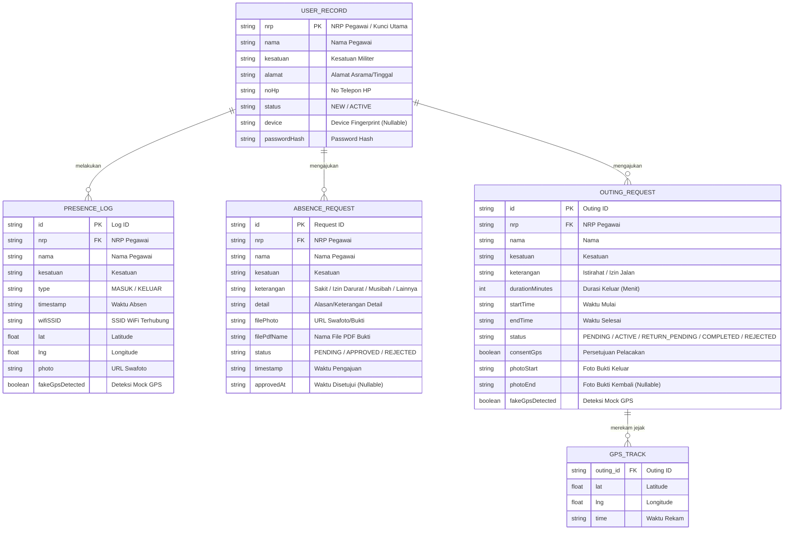
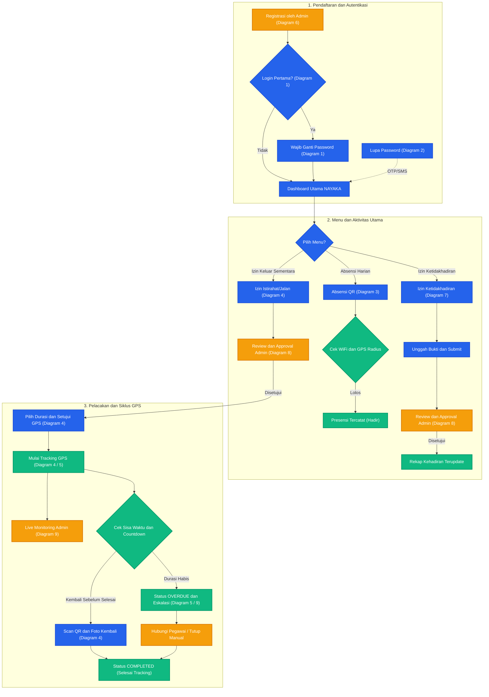
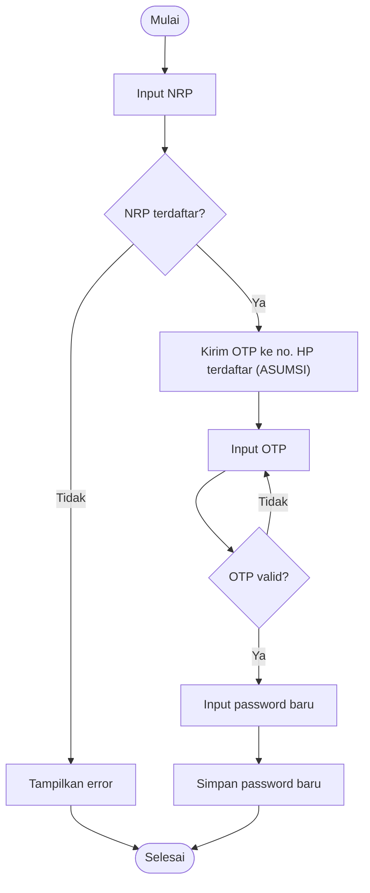
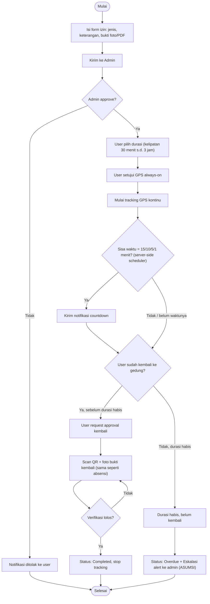
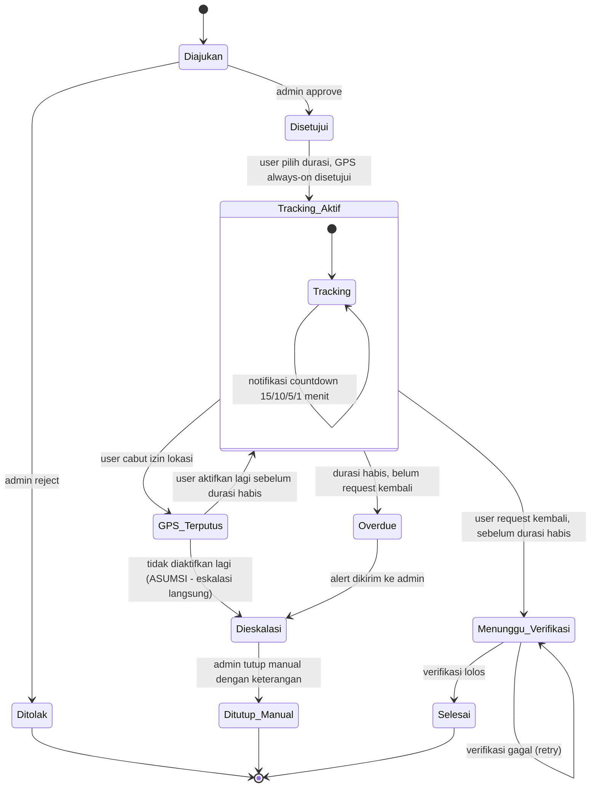
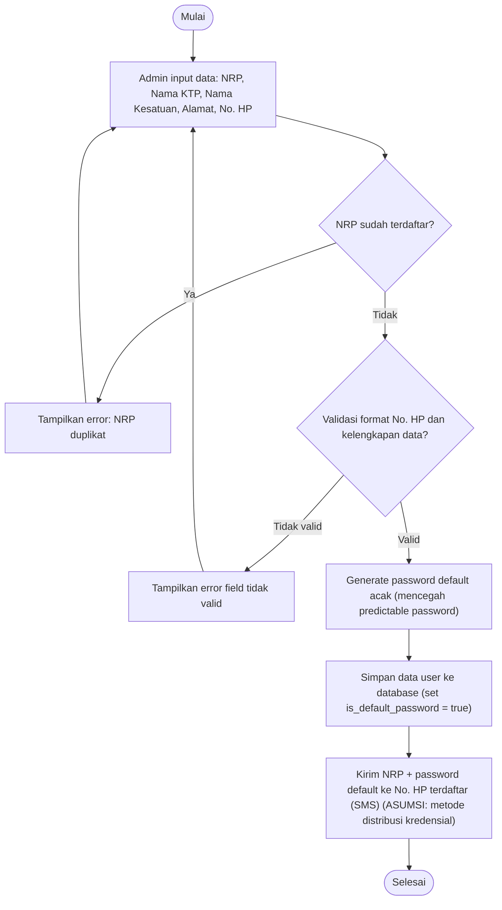
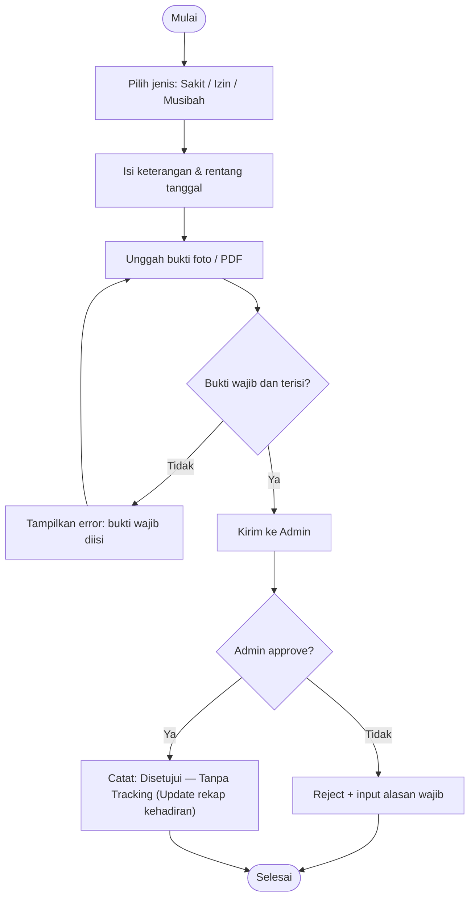
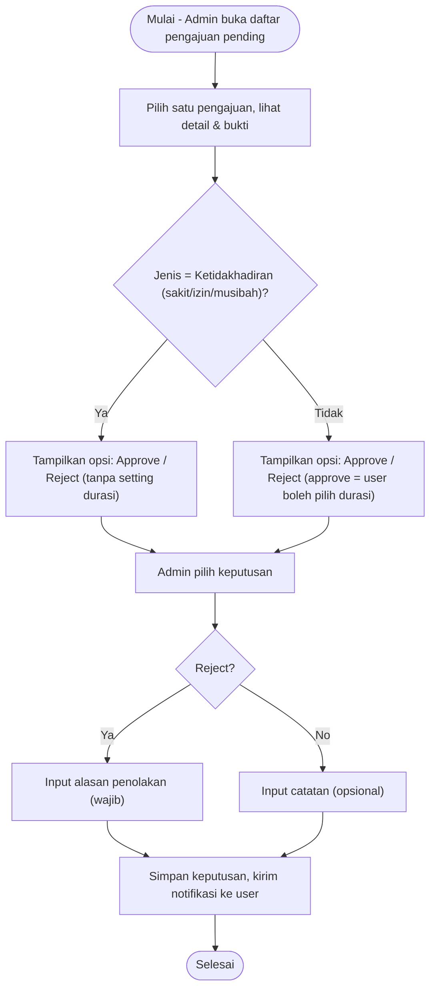
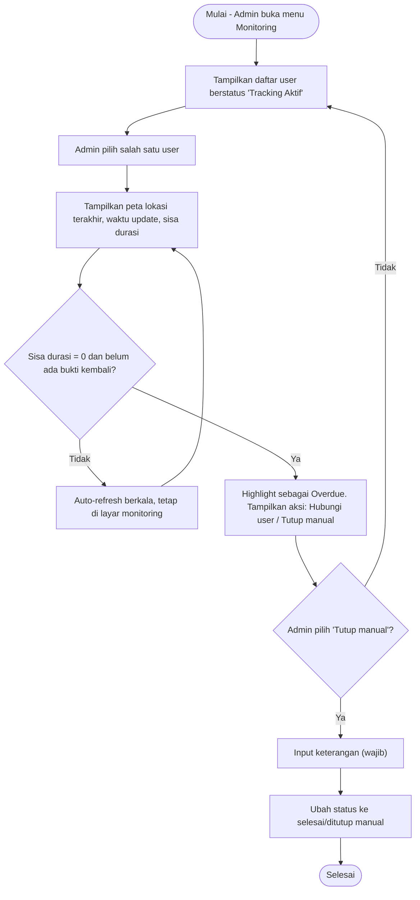

# 🛡️ NAYAKA - Mobile Attendance & Work Tracking Mockup

Aplikasi **NAYAKA** adalah purwarupa (*interactive high-fidelity mockup*) sistem presensi berbasis *geofencing* keamanan tingkat tinggi yang dirancang untuk personel militer/satuan kerja (studi kasus: Brigif 87). Purwarupa ini mensimulasikan interaksi antara aplikasi mobile anggota, dashboard komando, serta simulator rekayasa lingkungan siber secara bersamaan dalam satu layar.

---

## 🚀 1. Cara Menjalankan Projek (Installation & Run)

### Prasyarat:
* Pastikan Anda sudah menginstal **Node.js** (versi terbaru direkomendasikan) di komputer Anda.

### Langkah-langkah:
1. **Instal Dependensi**:
   Buka terminal di dalam direktori projek dan jalankan:
   ```bash
   npm install
   ```
2. **Jalankan Development Server**:
   ```bash
   npm run dev
   ```
3. **Akses Aplikasi**:
   Buka peramban (browser) dan buka alamat **[http://localhost:3000](http://localhost:3000)**.

> [!WARNING]
> ### Perhatian Pengguna Windows (Masalah Karakter `&` pada Path)
> Jika folder projek Anda saat ini bernama `presensi-&-track-kerja` atau berada di dalam folder yang mengandung simbol `&`, Windows (CMD/PowerShell) akan memperlakukannya sebagai pemisah perintah. Hal ini dapat menggagalkan eksekusi `npm run dev` dengan error:
> `'-track-kerja\node_modules\.bin\' is not recognized as an internal or external command`
>
> **Solusi:**
> * **Opsi A (Direkomendasikan):** Ubah nama folder projek Anda menjadi nama lain tanpa simbol khusus (misalnya: `presensi-dan-track-kerja` atau `nayaka-mockup`).
> * **Opsi B (Alternatif Tanpa Ubah Folder):** Jalankan server langsung menggunakan Node dengan memanggil path file Vite yang terbungkus tanda kutip:
>   ```powershell
>   node "c:\Users\HP\Downloads\testing2\presensi-&-track-kerja\node_modules\vite\bin\vite.js" --port 3000 --host 0.0.0.0
>   ```

---

## 🧪 2. Alur Pengujian UI/UX (Interactive Testing Flow)

Anda dapat menguji logika aplikasi dengan memanfaatkan panel simulator di sisi kiri layar untuk memicu respons reaktif pada antarmuka pengguna:

### Pengujian Skenario 1: Login Pertama & Kunci Perangkat
1. Masuk ke frame **Sisi User (Tengah)**, masukkan NRP default `123456` dan password `password123`.
2. Klik **Login**.
3. Sistem secara otomatis mendeteksi model/spesifikasi HP Anda di latar belakang (Hardware Fingerprint) dan menampilkan modal keamanan untuk **Wajib Ganti Password**.
4. Masukkan password baru (minimal 6 karakter) untuk mengubah status akun Anda dari `NEW` menjadi `ACTIVE`.

### Pengujian Skenario 2: Presensi Geofence QR
1. Pilih tab **Presensi** pada aplikasi anggota di tengah.
2. **Pengujian Gagal (WiFi Seluler):** Pada panel simulator (Kiri), set WiFi ke **Seluler (LTE)**. Coba klik tombol presensi. Sistem akan menolak presensi karena tidak terhubung WiFi resmi.
3. **Pengujian Gagal (Geofence GPS):** Pada panel simulator, set WiFi ke **WiFi Kantor** dan GPS ke **Luar Kantor (Outside)**. Coba klik presensi. Sistem akan memblokir karena Anda berada di luar radius 50m.
4. **Pengujian Gagal (Fake GPS/Spoofing):** Set GPS ke **Fake GPS / Mock Location**. Sistem akan langsung memblokir akses dan mencatat log manipulasi lokasi untuk dilaporkan ke komandan.
5. **Pengujian Sukses:** Set WiFi ke **WiFi Kantor** dan GPS ke **Kantor (Office)**. Lakukan swafoto lalu klik scan QR. Presensi Anda akan tercatat sukses di server.

### Pengujian Skenario 3: Siklus Izin Keluar Kantor (Outing Tracking)
1. Pada aplikasi anggota, pilih tab **Izin Keluar**. Isi tujuan (misal: "Beli Makan") dan durasi (misal: 30 menit), lalu setujui pelacakan GPS. Klik **Kirim Permohonan**.
2. Buka frame **Sisi Admin (Kanan)**, masuk ke tab **Persetujuan Izin**. Klik **Setujui** pada permohonan anggota tersebut. Status anggota akan berubah menjadi **Berizin Luar Kantor**.
3. Pada panel simulator (Kiri), ubah lokasi GPS menjadi **Luar Kantor (Outside)**. Anda dapat mengklik **Akselerasikan Waktu** untuk mensimulasikan countdown sisa waktu.
4. Perhatikan notifikasi push peringatan yang akan menyala otomatis di HP anggota ketika waktu tersisa **15 menit**, **10 menit**, **5 menit**, dan **1 menit**.
5. Di panel admin, Anda akan melihat histori pelacakan titik peta GPS (*breadcrumbs*) dari anggota tersebut secara real-time.
6. Untuk menyelesaikan sesi, ubah kembali koneksi di simulator ke **WiFi Kantor**, lalu pada aplikasi anggota klik **Konfirmasi Kembali**. Admin kemudian meninjau dan menyelesaikan izin tersebut.

---

## 📊 3. Skema Database (Entity Relationship Diagram - ERD)

Berikut adalah cetak biru skema relasi database relasional jika prototype ini diimplementasikan ke dalam production backend:



---

## 🗺️ 4. Peta Arsitektur Logika Sistem (Overview & Flowcharts)

Bagian ini menyajikan peta hubungan alur (overview) antar-proses dalam ekosistem NAYAKA, diikuti oleh 9 diagram alur logika detail yang memetakan aktivitas User, Admin, dan Server secara mendalam.

### 🗺️ A. Overview: Peta Alur Hubungan Antar-Proses


---

### 🗺️ B. Diagram Alur Detail (9 Flowcharts)

Berikut adalah 9 diagram alur logika detail yang memetakan aktivitas sistem NAYAKA secara spesifik:

### 1. Diagram Alur: Login & Ganti Password


### 2. Diagram Alur: Lupa Password


### 3. Diagram Alur: Absensi QR


### 4. Diagram Alur: Izin Istirahat-Jalan (dengan Tracking GPS)


### 5. Diagram State: Siklus Izin


### 6. Diagram Alur: Registrasi User oleh Admin


### 7. Diagram Alur: Izin Ketidakhadiran (Tanpa Tracking)


### 8. Diagram Alur: Admin - Review Keputusan Izin


### 9. Diagram Alur: Admin - Monitoring Tracking GPS


### 🔍 Catatan Verifikasi Alur & Keselarasan Kode Mockup

1. **Sinkronisasi Desain vs Mockup (First Iteration):**
   * Sesuai dengan batasan mockup saat ini, data durasi izin keluar dan persetujuan GPS sudah diisi langsung oleh user pada form pengajuan (sebelum disetujui Admin). Di production kelak, alur dapat diselaraskan dengan Diagram 4 di mana penentuan durasi dilakukan pasca-persetujuan agar waktu durasi tidak berkurang selama menunggu *approval* komandan.
2. **Mitigasi GPS Terputus (Diagram 5 - State `s5`):**
   * Penanganan state `GPS_Terputus` (seperti saat user mematikan GPS di tengah sesi) merupakan bagian penting yang diidentifikasi dalam flowchart. Pada iterasi ini, logika tersebut dirancang sebagai *business logic* yang wajib diimplementasikan pada backend production untuk mencegah celah manipulasi kehadiran.
3. **Mekanisme OTP & Distribusi Kredensial:**
   * Fitur Lupa Password (Diagram 2) dan Registrasi Admin (Diagram 6) masih berstatus simulasi/asumsi (*mock*) pada antarmuka frontend, dan akan membutuhkan integrasi dengan SMS/WhatsApp Gateway API untuk implementasi backend penuh.


---

## 📦 5. Panduan Mengunggah ke GitHub (Git Push Guide)

Gunakan panduan berikut untuk mengunggah berkas projek lokal Anda ke repositori GitHub yang telah disiapkan secara manual (tidak dilakukan otomatis oleh asisten AI):

1. **Buka Terminal / Command Prompt** pada folder projek:
   ```bash
   cd c:\Users\HP\Downloads\testing2\presensi-&-track-kerja
   ```
2. **Inisialisasi Git Lokal** (jika belum pernah diinisialisasi):
   ```bash
   git init
   ```
3. **Tambahkan File ke Staging Area**:
   ```bash
   git add .
   ```
4. **Buat Commit Pertama**:
   ```bash
   git commit -m "Initial commit: Nayaka Mobile Attendance Mockup"
   ```
5. **Set Nama Branch Utama ke `main`**:
   ```bash
   git branch -M main
   ```
6. **Hubungkan dengan Repositori GitHub**:
   ```bash
   git remote add origin https://github.com/IntellQueue/Mockup-UI-UX-NAYAKA.git
   ```
   *(Catatan: Jika remote origin sudah ada, Anda dapat menghapusnya terlebih dahulu dengan `git remote remove origin` lalu menambahkannya kembali).*
7. **Unggah (Push) ke GitHub**:
   ```bash
   git push -u origin main
   ```
