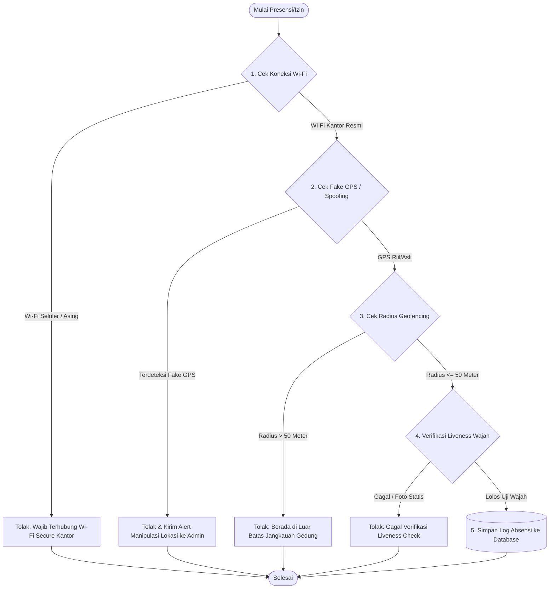
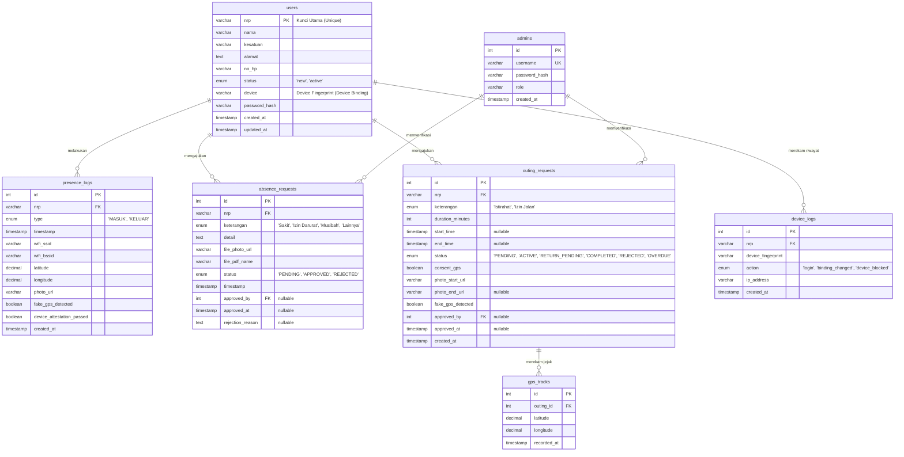
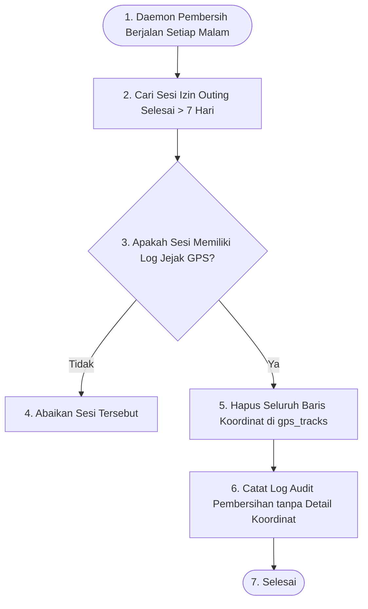
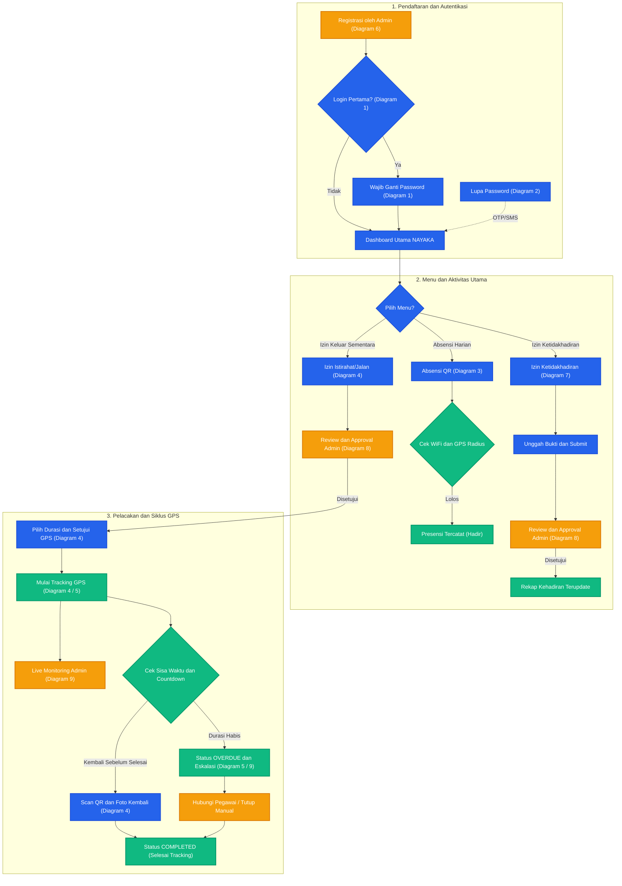
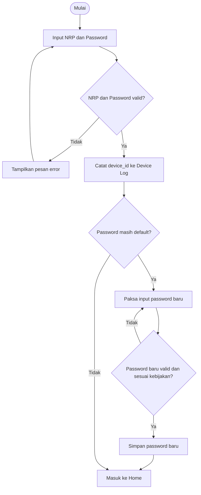
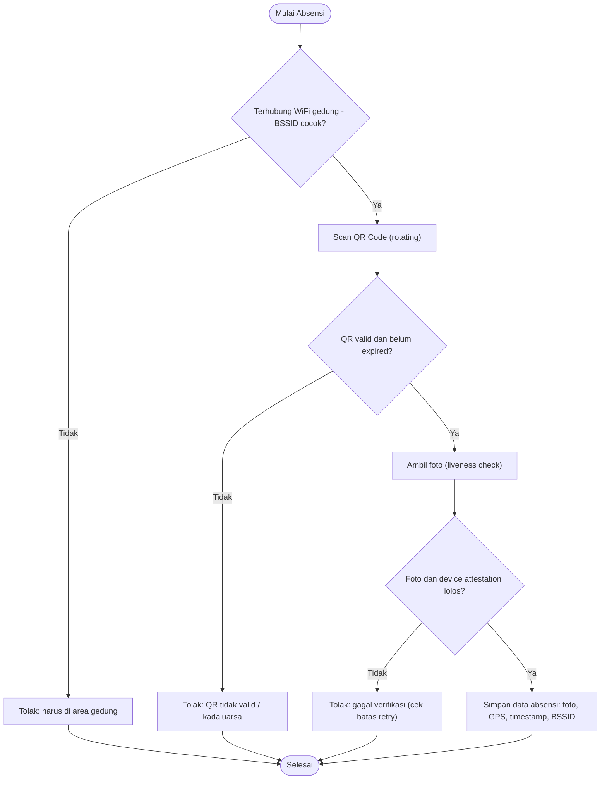
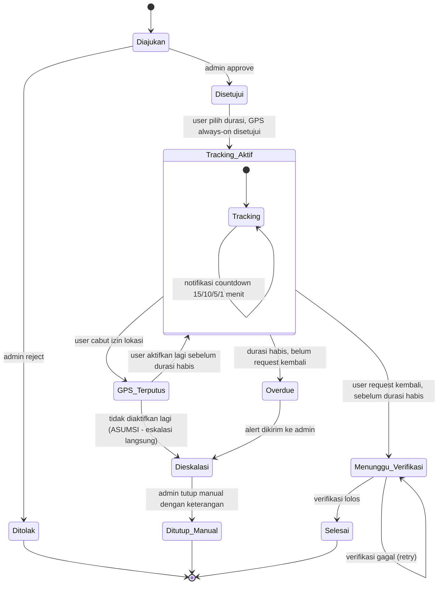

# 🛡️ NAYAKA - Mobile Attendance & Work Tracking Mockup

Aplikasi **NAYAKA** adalah purwarupa (*interactive high-fidelity mockup*) sistem presensi berbasis *geofencing* keamanan tingkat tinggi yang dirancang untuk personel militer/satuan kerja (studi kasus: Brigif 87). Purwarupa ini mensimulasikan interaksi antara aplikasi mobile anggota, dashboard komando, serta simulator rekayasa lingkungan siber secara bersamaan dalam satu layar.

---

## 🚀 1. Cara Menjalankan Projek (Installation & Run)

### Prasyarat:
* Pastikan Anda sudah menginstal **Node.js** (versi terbaru direkomendasikan) di komputer Anda.

### Langkah-langkah:
1. **Instal Dependensi**:
   Buka terminal di dalam direktori projek dan jalankan:
   ```bash
   npm install
   ```
2. **Jalankan Development Server**:
   ```bash
   npm run dev
   ```
3. **Akses Aplikasi**:
   Buka peramban (browser) dan buka alamat **[http://localhost:3000](http://localhost:3000)**.

> [!WARNING]
> ### Perhatian Pengguna Windows (Masalah Karakter `&` pada Path)
> Jika folder projek Anda saat ini bernama `presensi-&-track-kerja` atau berada di dalam folder yang mengandung simbol `&`, Windows (CMD/PowerShell) akan memperlakukannya sebagai pemisah perintah. Hal ini dapat menggagalkan eksekusi `npm run dev` dengan error:
> `'-track-kerja\node_modules\.bin\' is not recognized as an internal or external command`
>
> **Solusi:**
> * **Opsi A (Direkomendasikan):** Ubah nama folder projek Anda menjadi nama lain tanpa simbol khusus (misalnya: `presensi-dan-track-kerja` atau `nayaka-mockup`).
> * **Opsi B (Alternatif Tanpa Ubah Folder):** Jalankan server langsung menggunakan Node dengan memanggil path file Vite yang terbungkus tanda kutip:
>   ```powershell
>   node "c:\Users\HP\Downloads\testing2\presensi-&-track-kerja\node_modules\vite\bin\vite.js" --port 3000 --host 0.0.0.0
>   ```

---

## 🧪 2. Alur Pengujian UI/UX (Interactive Testing Flow)

Anda dapat menguji logika aplikasi dengan memanfaatkan panel simulator di sisi kiri layar untuk memicu respons reaktif pada antarmuka pengguna:

### Pengujian Skenario 1: Login Pertama & Kunci Perangkat
1. Masuk ke frame **Sisi User (Tengah)**, masukkan NRP default `123456` dan password `password123`.
2. Klik **Login**.
3. Sistem secara otomatis mendeteksi model/spesifikasi HP Anda di latar belakang (Hardware Fingerprint) dan menampilkan modal keamanan untuk **Wajib Ganti Password**.
4. Masukkan password baru (minimal 6 karakter) untuk mengubah status akun Anda dari `NEW` menjadi `ACTIVE`.

### Pengujian Skenario 2: Presensi Geofence QR
1. Pilih tab **Presensi** pada aplikasi anggota di tengah.
2. **Pengujian Gagal (WiFi Seluler):** Pada panel simulator (Kiri), set WiFi ke **Seluler (LTE)**. Coba klik tombol presensi. Sistem akan menolak presensi karena tidak terhubung WiFi resmi.
3. **Pengujian Gagal (Geofence GPS):** Pada panel simulator, set WiFi ke **WiFi Kantor** dan GPS ke **Luar Kantor (Outside)**. Coba klik presensi. Sistem akan memblokir karena Anda berada di luar radius 50m.
4. **Pengujian Gagal (Fake GPS/Spoofing):** Set GPS ke **Fake GPS / Mock Location**. Sistem akan langsung memblokir akses dan mencatat log manipulasi lokasi untuk dilaporkan ke komandan.
5. **Pengujian Sukses:** Set WiFi ke **WiFi Kantor** dan GPS ke **Kantor (Office)**. Lakukan swafoto lalu klik scan QR. Presensi Anda akan tercatat sukses di server.

### Pengujian Skenario 3: Siklus Izin Keluar Kantor (Outing Tracking)
1. Pada aplikasi anggota, pilih tab **Izin Keluar**. Isi tujuan (misal: "Beli Makan") dan durasi (misal: 30 menit), lalu setujui pelacakan GPS. Klik **Kirim Permohonan**.
2. Buka frame **Sisi Admin (Kanan)**, masuk ke tab **Persetujuan Izin**. Klik **Setujui** pada permohonan anggota tersebut. Status anggota akan berubah menjadi **Berizin Luar Kantor**.
3. Pada panel simulator (Kiri), ubah lokasi GPS menjadi **Luar Kantor (Outside)**. Anda dapat mengklik **Akselerasikan Waktu** untuk mensimulasikan countdown sisa waktu.
4. Perhatikan notifikasi push peringatan yang akan menyala otomatis di HP anggota ketika waktu tersisa **15 menit**, **10 menit**, **5 menit**, dan **1 menit**.
5. Di panel admin, Anda akan melihat histori pelacakan titik peta GPS (*breadcrumbs*) dari anggota tersebut secara real-time.
6. Untuk menyelesaikan sesi, ubah kembali koneksi di simulator ke **WiFi Kantor**, lalu pada aplikasi anggota klik **Konfirmasi Kembali**. Admin kemudian meninjau dan menyelesaikan izin tersebut.

---

## 📊 3. Perancangan Database & Skema Relasi (Database Design & ERD)

Jika aplikasi **NAYAKA** dikembangkan menjadi sistem produksi nyata, diperlukan sistem manajemen database relasional (RDBMS) seperti PostgreSQL atau MySQL/MariaDB untuk mengelola data operasional dan keamanan secara tangguh.

---

### 🛡️ A. Flowchart Alur Verifikasi Keamanan NAYAKA

Sebelum data dicatat ke database, sistem melakukan validasi keamanan berlapis (*multi-layered validation*) untuk memastikan integritas data presensi dan pencegahan manipulasi lokasi:



---

### 🗺️ B. Entity Relationship Diagram (ERD)

Berikut adalah diagram relasi entitas untuk mendukung seluruh fitur autentikasi, presensi geofencing, pengajuan izin, dan pelacakan GPS NAYAKA:



---

### 📑 C. Spesifikasi Detail Tabel Database

#### 1. Tabel `users`
Menyimpan data induk profil personil militer / pegawai satuan kerja (e.g. Brigif 87).
*   Kolom `device` bertindak sebagai *Device Binding* (Hardware Fingerprint) yang dikunci pada saat login pertama kali (`status = 'new'`).

| Nama Kolom | Tipe Data | Atribut | Deskripsi |
| :--- | :--- | :--- | :--- |
| **nrp** | VARCHAR(30) | PK | Nomor Registrasi Pokok (Unique Identifier) |
| **nama** | VARCHAR(150) | NOT NULL | Nama lengkap personel |
| **kesatuan** | VARCHAR(100) | NOT NULL | Nama unit/kesatuan militer |
| **alamat** | TEXT | NOT NULL | Alamat tinggal/asrama |
| **no_hp** | VARCHAR(20) | NOT NULL | Nomor WhatsApp aktif untuk verifikasi OTP |
| **status** | ENUM | DEFAULT 'new' | Status akun: `'new'` (wajib ganti password) atau `'active'` |
| **device** | VARCHAR(255) | NULLABLE | Fingerprint hardware perangkat terdaftar |
| **password_hash** | VARCHAR(255) | NOT NULL | Password terenkripsi (Bcrypt/Argon2) |
| **created_at** | TIMESTAMP | DEFAULT CURRENT_TIMESTAMP | Log pendaftaran user |
| **updated_at** | TIMESTAMP | NULLABLE | Log perubahan profil terakhir |

#### 2. Tabel `admins`
Menyimpan informasi akun administrator komando yang mengelola registrasi personel dan persetujuan izin.

| Nama Kolom | Tipe Data | Atribut | Deskripsi |
| :--- | :--- | :--- | :--- |
| **id** | INT | PK, AUTO_INCREMENT | ID unik admin |
| **username** | VARCHAR(50) | UNIQUE, NOT NULL | Username login admin |
| **password_hash** | VARCHAR(255) | NOT NULL | Password terenkripsi (Bcrypt/Argon2) |
| **role** | VARCHAR(50) | NOT NULL | Hak akses admin (e.g. `'Superadmin'`, `'Operator'`) |
| **created_at** | TIMESTAMP | DEFAULT CURRENT_TIMESTAMP | Log pembuatan akun admin |

#### 3. Tabel `device_logs`
Menyimpan riwayat pergantian binding perangkat, aktivitas masuk, dan tindakan penguncian akun demi kepatuhan audit sistem keamanan.

| Nama Kolom | Tipe Data | Atribut | Deskripsi |
| :--- | :--- | :--- | :--- |
| **id** | INT | PK, AUTO_INCREMENT | ID unik log perangkat |
| **nrp** | VARCHAR(30) | FK, NOT NULL | NRP pegawai yang bersangkutan |
| **device_fingerprint** | VARCHAR(255) | NOT NULL | Metadata detail perangkat terdeteksi |
| **action** | ENUM | NOT NULL | Jenis tindakan: `'login'`, `'binding_changed'`, `'device_blocked'` |
| **ip_address** | VARCHAR(45) | NOT NULL | IP Address saat melakukan aktivitas |
| **created_at** | TIMESTAMP | DEFAULT CURRENT_TIMESTAMP | Log waktu aktivitas tercatat |

#### 4. Tabel `presence_logs`
Mencatat seluruh detail riwayat presensi QR masuk & keluar gedung kantor resmi secara real-time.

| Nama Kolom | Tipe Data | Atribut | Deskripsi |
| :--- | :--- | :--- | :--- |
| **id** | INT | PK, AUTO_INCREMENT | ID unik log presensi |
| **nrp** | VARCHAR(30) | FK, NOT NULL | NRP pegawai yang melakukan presensi |
| **type** | ENUM | NOT NULL | Jenis presensi: `'MASUK'` atau `'KELUAR'` |
| **timestamp** | TIMESTAMP | NOT NULL | Waktu aktual presensi ditekan oleh user |
| **wifi_ssid** | VARCHAR(50) | NOT NULL | SSID WiFi yang terhubung (e.g. `NAYAKA-WIFI-SECURE`) |
| **wifi_bssid** | VARCHAR(30) | NOT NULL | Alamat MAC router WiFi (BSSID) untuk pencegahan spoofing |
| **latitude** | DECIMAL(10, 8) | NOT NULL | Titik lintang GPS user saat presensi |
| **longitude** | DECIMAL(11, 8) | NOT NULL | Titik bujur GPS user saat presensi |
| **photo_url** | VARCHAR(2083) | NOT NULL | Path/URL cloud storage foto selfie verifikasi wajah |
| **fake_gps_detected** | BOOLEAN | DEFAULT FALSE | Flag penunjuk jika terdeteksi Fake GPS/Mock Location |
| **device_attestation_passed** | BOOLEAN | DEFAULT TRUE | Hasil validasi Google Play Integrity / Apple DeviceCheck |
| **created_at** | TIMESTAMP | DEFAULT CURRENT_TIMESTAMP | Waktu data tersimpan di server |

#### 5. Tabel `absence_requests`
Menangani pengajuan izin ketidakhadiran penuh satu hari atau lebih (e.g. Sakit, Izin Darurat, Musibah) yang disertai pengunggahan bukti dokumen tanpa pelacakan GPS.

| Nama Kolom | Tipe Data | Atribut | Deskripsi |
| :--- | :--- | :--- | :--- |
| **id** | INT | PK, AUTO_INCREMENT | ID unik pengajuan |
| **nrp** | VARCHAR(30) | FK, NOT NULL | NRP pengaju izin |
| **keterangan** | ENUM | NOT NULL | Alasan: `'Sakit'`, `'Izin Darurat'`, `'Musibah'`, atau `'Lainnya'` |
| **detail** | TEXT | NOT NULL | Deskripsi detail atau kronologi alasan |
| **file_photo_url** | VARCHAR(2083) | NOT NULL | URL foto bukti pendukung (e.g. surat dokter) |
| **file_pdf_name** | VARCHAR(255) | NOT NULL | Nama berkas PDF pendukung yang diunggah |
| **status** | ENUM | DEFAULT 'PENDING' | Status persetujuan: `'PENDING'`, `'APPROVED'`, `'REJECTED'` |
| **timestamp** | TIMESTAMP | DEFAULT CURRENT_TIMESTAMP | Waktu permohonan dibuat |
| **approved_by** | INT | FK, NULLABLE | ID Admin yang meninjau/memberi keputusan |
| **approved_at** | TIMESTAMP | NULLABLE | Log waktu admin memberikan keputusan |
| **rejection_reason** | TEXT | NULLABLE | Catatan alasan penolakan jika status ditolak |

#### 6. Tabel `outing_requests`
Menangani siklus permohonan izin keluar sementara (jam kerja) yang memerlukan persetujuan dan pelacakan GPS latar belakang secara kontinu.

| Nama Kolom | Tipe Data | Atribut | Deskripsi |
| :--- | :--- | :--- | :--- |
| **id** | INT | PK, AUTO_INCREMENT | ID unik izin keluar |
| **nrp** | VARCHAR(30) | FK, NOT NULL | NRP pengaju izin |
| **keterangan** | ENUM | NOT NULL | Keperluan keluar: `'Istirahat'` atau `'Izin Jalan'` |
| **duration_minutes**| INT | NOT NULL | Durasi izin dalam menit (e.g. `30`, `60`, `120`) |
| **start_time** | TIMESTAMP | NULLABLE | Waktu mulai izin (saat disetujui/aktif) |
| **end_time** | TIMESTAMP | NULLABLE | Batas akhir waktu izin kembali |
| **status** | ENUM | DEFAULT 'PENDING' | Status siklus: `'PENDING'`, `'ACTIVE'`, `'RETURN_PENDING'`, `'COMPLETED'`, `'REJECTED'`, `'OVERDUE'` |
| **consent_gps** | BOOLEAN | DEFAULT FALSE | Persetujuan perekaman GPS latar belakang |
| **photo_start_url**| VARCHAR(2083) | NOT NULL | Foto bukti check-out keluar gerbang |
| **photo_end_url** | VARCHAR(2083) | NULLABLE | Foto bukti check-in kembali di gerbang |
| **fake_gps_detected**| BOOLEAN | DEFAULT FALSE | Deteksi manipulasi lokasi selama sesi luar kantor |
| **approved_by** | INT | FK, NULLABLE | ID Admin yang memverifikasi pengajuan |
| **approved_at** | TIMESTAMP | NULLABLE | Waktu persetujuan dari admin |
| **created_at** | TIMESTAMP | DEFAULT CURRENT_TIMESTAMP | Log pembuatan pengajuan |

#### 7. Tabel `gps_tracks`
Menyimpan jejak koordinat (*breadcrumbs*) pergerakan personel selama status izin keluar mereka aktif (`status = 'ACTIVE'`).

| Nama Kolom | Tipe Data | Atribut | Deskripsi |
| :--- | :--- | :--- | :--- |
| **id** | INT | PK, AUTO_INCREMENT | ID koordinat log |
| **outing_id** | INT | FK, NOT NULL | Relasi ke tabel `outing_requests` (Cascade Delete) |
| **latitude** | DECIMAL(10, 8) | NOT NULL | Lintang koordinat |
| **longitude** | DECIMAL(11, 8) | NOT NULL | Bujur koordinat |
| **recorded_at** | TIMESTAMP | DEFAULT CURRENT_TIMESTAMP | Waktu koordinat dikirim oleh background service HP |

---

### 💻 D. Script SQL DDL (Skema Pembuatan Tabel)

<details>
<summary>📂 Klik untuk melihat script SQL CREATE TABLE (DDL)</summary>

```sql
-- 1. Membuat Tabel Master Admin
CREATE TABLE admins (
    id INT AUTO_INCREMENT PRIMARY KEY,
    username VARCHAR(50) UNIQUE NOT NULL,
    password_hash VARCHAR(255) NOT NULL,
    role VARCHAR(50) NOT NULL,
    created_at TIMESTAMP DEFAULT CURRENT_TIMESTAMP
);

-- 2. Membuat Tabel Master Users (Pegawai/Personel)
CREATE TABLE users (
    nrp VARCHAR(30) PRIMARY KEY,
    nama VARCHAR(150) NOT NULL,
    kesatuan VARCHAR(100) NOT NULL,
    alamat TEXT NOT NULL,
    no_hp VARCHAR(20) NOT NULL,
    status ENUM('new', 'active') DEFAULT 'new',
    device VARCHAR(255) NULL,
    password_hash VARCHAR(255) NOT NULL,
    created_at TIMESTAMP DEFAULT CURRENT_TIMESTAMP,
    updated_at TIMESTAMP NULL ON UPDATE CURRENT_TIMESTAMP
);

-- 3. Membuat Tabel Log Audit Device
CREATE TABLE device_logs (
    id INT AUTO_INCREMENT PRIMARY KEY,
    nrp VARCHAR(30) NOT NULL,
    device_fingerprint VARCHAR(255) NOT NULL,
    action ENUM('login', 'binding_changed', 'device_blocked') NOT NULL,
    ip_address VARCHAR(45) NOT NULL,
    created_at TIMESTAMP DEFAULT CURRENT_TIMESTAMP,
    FOREIGN KEY (nrp) REFERENCES users(nrp) ON DELETE CASCADE
);

-- 4. Membuat Tabel Log Presensi QR & Wi-Fi Check
CREATE TABLE presence_logs (
    id INT AUTO_INCREMENT PRIMARY KEY,
    nrp VARCHAR(30) NOT NULL,
    type ENUM('MASUK', 'KELUAR') NOT NULL,
    timestamp TIMESTAMP NOT NULL,
    wifi_ssid VARCHAR(50) NOT NULL,
    wifi_bssid VARCHAR(30) NOT NULL,
    latitude DECIMAL(10, 8) NOT NULL,
    longitude DECIMAL(11, 8) NOT NULL,
    photo_url VARCHAR(2083) NOT NULL,
    fake_gps_detected BOOLEAN DEFAULT FALSE,
    device_attestation_passed BOOLEAN DEFAULT TRUE,
    created_at TIMESTAMP DEFAULT CURRENT_TIMESTAMP,
    FOREIGN KEY (nrp) REFERENCES users(nrp) ON DELETE CASCADE
);

-- 5. Tabel Izin Ketidakhadiran (Sakit / Musibah)
CREATE TABLE absence_requests (
    id INT AUTO_INCREMENT PRIMARY KEY,
    nrp VARCHAR(30) NOT NULL,
    keterangan ENUM('Sakit', 'Izin Darurat', 'Musibah', 'Lainnya') NOT NULL,
    detail TEXT NOT NULL,
    file_photo_url VARCHAR(2083) NOT NULL,
    file_pdf_name VARCHAR(255) NOT NULL,
    status ENUM('PENDING', 'APPROVED', 'REJECTED') DEFAULT 'PENDING',
    timestamp TIMESTAMP DEFAULT CURRENT_TIMESTAMP,
    approved_by INT NULL,
    approved_at TIMESTAMP NULL,
    rejection_reason TEXT NULL,
    FOREIGN KEY (nrp) REFERENCES users(nrp) ON DELETE CASCADE,
    FOREIGN KEY (approved_by) REFERENCES admins(id) ON DELETE SET NULL
);

-- 6. Tabel Izin Keluar Jam Kerja (Outing GPS)
CREATE TABLE outing_requests (
    id INT AUTO_INCREMENT PRIMARY KEY,
    nrp VARCHAR(30) NOT NULL,
    keterangan ENUM('Istirahat', 'Izin Jalan') NOT NULL,
    duration_minutes INT NOT NULL,
    start_time TIMESTAMP NULL,
    end_time TIMESTAMP NULL,
    status ENUM('PENDING', 'ACTIVE', 'RETURN_PENDING', 'COMPLETED', 'REJECTED', 'OVERDUE') DEFAULT 'PENDING',
    consent_gps BOOLEAN DEFAULT FALSE,
    photo_start_url VARCHAR(2083) NOT NULL,
    photo_end_url VARCHAR(2083) NULL,
    fake_gps_detected BOOLEAN DEFAULT FALSE,
    approved_by INT NULL,
    approved_at TIMESTAMP NULL,
    created_at TIMESTAMP DEFAULT CURRENT_TIMESTAMP,
    FOREIGN KEY (nrp) REFERENCES users(nrp) ON DELETE CASCADE,
    FOREIGN KEY (approved_by) REFERENCES admins(id) ON DELETE SET NULL
);

-- 7. Tabel Jejak GPS Breadcrumbs
CREATE TABLE gps_tracks (
    id INT AUTO_INCREMENT PRIMARY KEY,
    outing_id INT NOT NULL,
    latitude DECIMAL(10, 8) NOT NULL,
    longitude DECIMAL(11, 8) NOT NULL,
    recorded_at TIMESTAMP DEFAULT CURRENT_TIMESTAMP,
    FOREIGN KEY (outing_id) REFERENCES outing_requests(id) ON DELETE CASCADE
);
```
</details>

---

### 🛡️ E. Kebijakan Retensi Data Keamanan Tinggi & Pembersihan Otomatis

Pada sistem yang melibatkan personil keamanan atau militer, pemantauan koordinat GPS detail adalah data yang sangat sensitif. Untuk menghindari kebocoran rute perjalanan harian personel di masa depan, sistem menerapkan **Kebijakan Retensi 7 Hari**:

1.  **Pembersihan Log GPS (`gps_tracks`)**: Data koordinat detail dihapus secara otomatis dan permanen setelah **7 hari** terhitung sejak status izin dinyatakan selesai (`COMPLETED`), ditolak (`REJECTED`), atau terlambat (`OVERDUE`).
2.  **Pembersihan File Gambar (`presence_logs.photo_url` & `absence_requests.file_photo_url`)**: Dokumen foto selfie dihapus secara berkala dari cloud storage setelah **30 hari** untuk mengoptimalkan ruang penyimpanan, sementara ringkasan metadata teks tetap disimpan untuk pelaporan rekapitulasi komando.

#### 🔄 Flowchart Pembersihan Jejak GPS Otomatis



#### ⚙️ Implementasi SQL Event Scheduler (MySQL/MariaDB)

```sql
-- 1. Memastikan Event Scheduler aktif di server database
SET GLOBAL event_scheduler = ON;

-- 2. Membuat Scheduler Pembersihan Koordinat GPS Usia > 7 Hari
CREATE EVENT IF NOT EXISTS clean_old_gps_tracks
ON SCHEDULE EVERY 1 DAY
STARTS (CURRENT_DATE + INTERVAL 1 DAY + INTERVAL 3 HOUR) -- Berjalan setiap hari pukul 03:00 pagi
DO
BEGIN
    -- Menghapus baris log koordinat pada sesi outing yang telah selesai lebih dari 7 hari
    DELETE FROM gps_tracks 
    WHERE outing_id IN (
        SELECT id FROM outing_requests 
        WHERE status IN ('COMPLETED', 'REJECTED', 'OVERDUE')
        AND (end_time < NOW() - INTERVAL 7 DAY OR (end_time IS NULL AND created_at < NOW() - INTERVAL 7 DAY))
    );
END;
```

---

## 🗺️ 4. Peta Arsitektur Logika Sistem (Overview & Flowcharts)

Bagian ini menyajikan peta hubungan alur (overview) antar-proses dalam ekosistem NAYAKA, diikuti oleh 9 diagram alur logika detail yang memetakan aktivitas User, Admin, dan Server secara mendalam.

### 🗺️ A. Overview: Peta Alur Hubungan Antar-Proses


---

### 🗺️ B. Diagram Alur Detail (9 Flowcharts)

Berikut adalah 9 diagram alur logika detail yang memetakan aktivitas sistem NAYAKA secara spesifik:

### 1. Diagram Alur: Login & Ganti Password


### 2. Diagram Alur: Lupa Password


### 3. Diagram Alur: Absensi QR


### 4. Diagram Alur: Izin Istirahat-Jalan (dengan Tracking GPS)


### 5. Diagram State: Siklus Izin


### 6. Diagram Alur: Registrasi User oleh Admin


### 7. Diagram Alur: Izin Ketidakhadiran (Tanpa Tracking)


### 8. Diagram Alur: Admin - Review Keputusan Izin


### 9. Diagram Alur: Admin - Monitoring Tracking GPS


## 🔍 5. Analisis Detail Alur Kerja & Logika Sistem (Developer Guide)

Bagian ini memetakan ke-9 diagram alur logika sistem NAYAKA ke dalam spesifikasi teknis, aturan bisnis (*business rules*), serta mekanisme validasi keamanan untuk memandu para pengembang backend saat bermigrasi dari kode mockup ke database dan server production:

### 🔑 1. Login & Ganti Password (Diagram 1)
* **Tujuan Alur:** Mengamankan akun personel baru dan memastikan setiap pengguna masuk dengan perangkat terdaftar mereka saja.
* **Logika dan Validasi Teknis:**
  * **Autentikasi Kredensial:** Mencocokkan NRP dan password yang diinput dengan data ter-hash (Bcrypt/Argon2) di database.
  * **Device Fingerprinting (Device Binding):** Saat login sukses, aplikasi mengirimkan `device_id` unik (misal: IMEI, Google Advertising ID, atau UUID hardware) ke server. Server mencatatnya pada tabel `DEVICE_LOGS`. Jika terdeteksi login dari perangkat baru untuk akun yang sudah memiliki `device_id` terikat, login akan ditolak kecuali admin menyetujui pembersihan binding perangkat.
  * **Force Change Password:** Memeriksa status flag `is_password_default` di database. Jika bernilai `true`, aplikasi langsung mengunci navigasi beranda utama dan hanya menampilkan form ganti password. Form ini mewajibkan password baru yang memenuhi kebijakan kompleksitas (minimal 8 karakter, kombinasi huruf besar-kecil, angka, dan simbol).

### 💬 2. Lupa Password (Diagram 2)
* **Tujuan Alur:** Memberikan jalur mandiri bagi personel untuk merestorasi akses masuk tanpa harus mendatangi administrator secara langsung.
* **Logika dan Validasi Teknis:**
  * **Validasi Identitas:** Sistem memeriksa ketersediaan NRP pada tabel data pegawai.
  * **Mekanisme OTP (One-Time Password):** Server menghasilkan 6-digit angka OTP acak, menyimpannya di cache (Redis/Memcached) dengan waktu kedaluwarsa ketat (maksimal 5 menit), dan mengirimkannya via WhatsApp API / SMS Gateway terintegrasi ke nomor HP yang terdaftar.
  * **Rate Limiting:** Untuk mencegah serangan brute-force dan eksploitasi pulsa SMS, server wajib membatasi pengiriman OTP maksimal 3 kali dalam jendela waktu 10 menit per NRP.
  * **Reset Akses:** Setelah OTP divalidasi sukses oleh server, token reset satu kali pakai dikeluarkan untuk mengesahkan pengisian password baru.

### 📍 3. Absensi QR (Diagram 3)
* **Tujuan Alur:** Mencegah manipulasi lokasi kehadiran (absen dari rumah/luar jangkauan) melalui validasi berlapis secara real-time.
* **Logika dan Validasi Teknis:**
  * **Wi-Fi BSSID Restricted (Lapis 1):** Aplikasi mendeteksi alamat hardware (MAC Address/BSSID) dari router Wi-Fi yang sedang terhubung. Sistem membandingkannya dengan daftar BSSID resmi router gedung kantor (`NAYAKA-WIFI-SECURE`) di database. Koneksi VPN atau data seluler biasa tidak diizinkan.
  * **Geofence Radius Check (Lapis 2):** Menghitung jarak geometris (menggunakan formula Haversine/Euclidean) antara koordinat GPS ponsel pegawai dengan koordinat geografis resmi kantor. Jarak toleransi maksimal ditetapkan sebesar 50 meter.
  * **Rotating QR Code (Lapis 3):** QR Code yang ditampilkan pada layar monitor absensi kantor diproduksi secara dinamis di server dan berputar/berubah setiap 15 detik menggunakan token berbasis waktu (TOTP). Jika pegawai memotret QR Code lalu menscan-nya beberapa menit kemudian, absensi akan ditolak karena token QR telah kedaluwarsa.
  * **Liveness Face & Attestation (Lapis 4):** Kamera depan ponsel melakukan verifikasi wajah aktif (*liveness detection*) untuk membedakan wajah asli pegawai dari foto cetak atau video display. Selain itu, API Attestation (seperti Google Play Integrity / Apple DeviceCheck) dijalankan untuk mendeteksi perangkat yang di-root atau dimodifikasi (*jailbroken*).
  * **Anti-Mock Location:** Program mendeteksi penggunaan aplikasi Fake GPS melalui fungsi API sistem operasi (misal `location.isFromMockProvider()` di Android). Jika terdeteksi bernilai `true`, proses absensi langsung digagalkan dan pelanggaran dilaporkan ke log sistem.

### ⏱️ 4. Izin Istirahat-Jalan dengan Tracking GPS (Diagram 4)
* **Tujuan Alur:** Memberikan kelonggaran bagi personel untuk keluar area kantor secara sah untuk kebutuhan mendesak dengan pemantauan lokasi latar belakang.
* **Logika dan Validasi Teknis:**
  * **Pengajuan Awal:** Pegawai mengajukan permohonan dengan menginput jenis keperluan, bukti dokumen pendukung, durasi yang diminta (kelipatan 30 menit hingga maksimal 180 menit), serta memberikan persetujuan akses GPS terus menerus (*Always-On GPS Consent*).
  * **Pemberlakuan Izin:** Begitu status pengajuan diubah menjadi `ACTIVE` oleh admin, server mengaktifkan masa pelacakan. Di latar belakang perangkat ponsel, background location service mulai mengirimkan koordinat latitude dan longitude pegawai ke server setiap 5 atau 10 menit sekali.
  * **Mekanisme Peringatan Sisa Waktu:** Sistem penjadwal (*cron job/scheduler*) di server menghitung mundur durasi izin. Saat sisa waktu menyentuh 15, 10, 5, dan 1 menit, push notification otomatis terkirim untuk memperingatkan pegawai agar segera kembali ke kantor.
  * **Prosedur Kepulangan:** Pegawai wajib menempelkan kembali status kehadiran di kantor dengan melakukan scan QR Masuk & verifikasi Wi-Fi BSSID kantor untuk secara resmi menghentikan pelacakan lokasi latar belakang. Jika waktu habis sebelum konfirmasi kepulangan terdeteksi, status izin otomatis berubah menjadi `OVERDUE`.

### 🔄 5. State Diagram - Siklus Izin (Diagram 5)
* **Tujuan Alur:** Menjelaskan transisi data status permohonan izin dari awal hingga ditutup untuk menjaga integritas data riwayat.
* **Mekanisme Transisi Utama:**
  * **`Diajukan` -> `Disetujui`/`Ditolak`:** Dipicu oleh aksi persetujuan admin.
  * **`Disetujui` -> `Tracking_Aktif`:** Terjadi secara otomatis saat waktu mulai izin tercapai dan pegawai menyetujui izin runtime lokasi di ponsel.
  * **`Tracking_Aktif` -> `GPS_Terputus`:** Dipicu saat server mendeteksi hilangnya pengiriman detak jantung (*heartbeat*) koordinat lokasi dari ponsel pegawai selama lebih dari 10 menit berturut-turut (misal karena GPS dimatikan sengaja atau aplikasi dimatikan paksa).
  * **`GPS_Terputus` -> `Dieskalasi`:** Jika tidak ada pemulihan koneksi koordinat GPS setelah melewati durasi batas toleransi (misalnya 15 menit).
  * **`Tracking_Aktif` -> `Overdue`:** Dipicu oleh server jika durasi izin telah usai namun tidak ada request kembali dari pegawai.
  * **`Dieskalasi`/`Overdue` -> `Ditutup_Manual`:** Hanya bisa diselesaikan oleh admin dengan menginput berkas catatan klarifikasi disiplin.

### 📝 6. Registrasi User oleh Admin (Diagram 6)
* **Tujuan Alur:** Onboarding data personel secara resmi di dalam database pusat oleh pihak administrator.
* **Logika dan Validasi Teknis:**
  * **Pengecekan Duplikasi:** Memvalidasi input NRP terhadap tabel user utama untuk menghindari terjadinya NRP duplikat (NRP bertindak sebagai Unique Key).
  * **Validasi Struktur Data:** Memastikan nomor handphone menggunakan format internasional (+62).
  * **Keamanan Kredensial Default:** Menghindari penggunaan password default yang mudah ditebak (seperti `123456` atau tanggal lahir). Sistem di server harus menjanakan generator password acak alfanumerik yang kuat. Password awal ini dikirimkan langsung ke ponsel pengguna melalui SMS/WA Gateway terenkripsi.

### 📄 7. Izin Ketidakhadiran Tanpa Tracking (Diagram 7)
* **Tujuan Alur:** Mengakomodasi ketidakhadiran resmi seharian penuh atau lebih (seperti Sakit, Cuti Tahunan, Musibah) tanpa memicu pelacakan lokasi.
* **Logika dan Validasi Teknis:**
  * **Kelengkapan Dokumen:** Form mewajibkan pengunggahan bukti fisik (misal: surat keterangan dokter, PDF surat disposisi).
  * **Keamanan Unggah File:** Server harus mengecek ekstensi file (hanya mengizinkan `.pdf`, `.jpg`, `.jpeg`, `.png`), membatasi ukuran berkas maksimal 5MB, dan melakukan sanitasi nama berkas serta menyimpannya di storage terisolasi untuk menghindari celah serangan injeksi malware.
  * **Pembaruan Kehadiran:** Jika permohonan disetujui admin, sistem memperbarui total rekap kehadiran bulanan pegawai dengan status izin/sakit pada hari tersebut.

### 🛡️ 8. Admin - Review Keputusan Izin (Diagram 8)
* **Tujuan Alur:** Memberikan panel kendali bagi administrator untuk meninjau dan mengevaluasi pengajuan izin pegawai secara adil.
* **Logika dan Validasi Teknis:**
  * **Antarmuka Kontekstual:** Panel admin membedakan form tinjauan berdasarkan jenis pengajuan. Untuk izin keluar (outing), admin meninjau kesiapan tracking GPS, sedangkan untuk izin ketidakhadiran, admin meninjau keabsahan berkas surat bukti yang diunggah.
  * **Alasan Penolakan Wajib:** Jika admin memilih opsi `REJECTED`, sistem memvalidasi input field alasan penolakan. Field ini tidak boleh kosong agar personel mengetahui secara transparan dasar penolakan pengajuan mereka.

### 🗺️ 9. Admin - Monitoring Tracking GPS (Diagram 9)
* **Tujuan Alur:** Menyajikan peta pelacakan posisi personel secara real-time untuk menjamin kepatuhan lokasi selama di luar kantor.
* **Logika dan Validasi Teknis:**
  * **Integrasi Map API:** Merender peta dinamis (menggunakan OpenStreetMap dengan Leaflet.js atau Google Maps API). Koordinat lintang (latitude) dan bujur (longitude) yang dikirim background service pegawai di-plot menjadi garis jalur rekam jejak (*GPS breadcrumb trail*).
  * **Live Sync via WebSocket:** Menggunakan koneksi persisten seperti WebSockets (Socket.io) untuk menyalurkan pembaruan koordinat pegawai secara instan tanpa perlu membebani database dengan polling berkala dari browser admin.
  * **Penanganan Alarm Overdue:** Begitu ada pegawai dengan status berubah menjadi `OVERDUE` atau `Dieskalasi`, antarmuka peta admin secara dinamis memberikan highlight merah pada penanda lokasi pegawai tersebut dan membunyikan peringatan suara sebagai mitigasi keterlambatan.

---


## 📦 6. Panduan Mengunggah ke GitHub (Git Push Guide)

Gunakan panduan berikut untuk mengunggah berkas projek lokal Anda ke repositori GitHub yang telah disiapkan secara manual (tidak dilakukan otomatis oleh asisten AI):

1. **Buka Terminal / Command Prompt** pada folder projek:
   ```bash
   cd c:\Users\HP\Downloads\testing2\presensi-&-track-kerja
   ```
2. **Inisialisasi Git Lokal** (jika belum pernah diinisialisasi):
   ```bash
   git init
   ```
3. **Tambahkan File ke Staging Area**:
   ```bash
   git add .
   ```
4. **Buat Commit Pertama**:
   ```bash
   git commit -m "Initial commit: Nayaka Mobile Attendance Mockup"
   ```
5. **Set Nama Branch Utama ke `main`**:
   ```bash
   git branch -M main
   ```
6. **Hubungkan dengan Repositori GitHub**:
   ```bash
   git remote add origin https://github.com/IntellQueue/Mockup-UI-UX-NAYAKA.git
   ```
   *(Catatan: Jika remote origin sudah ada, Anda dapat menghapusnya terlebih dahulu dengan `git remote remove origin` lalu menambahkannya kembali).*
7. **Unggah (Push) ke GitHub**:
   ```bash
   git push -u origin main
   ```
